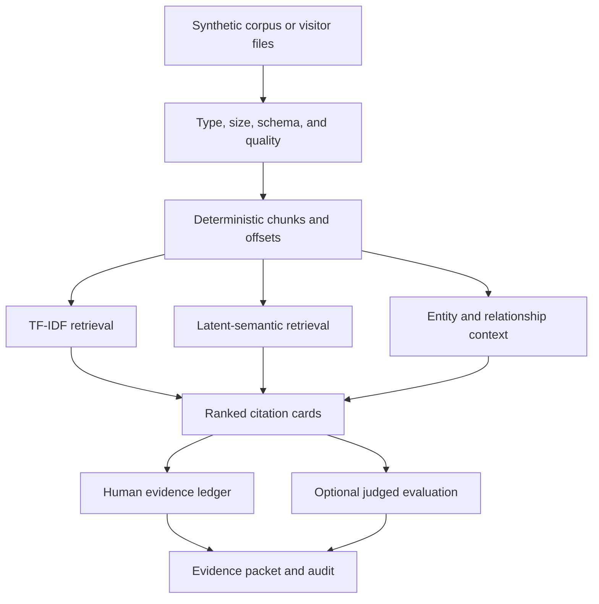

# Content Evidence Workbench

## Engineering Profile

| Field | Contract |
|---|---|
| Owner | Tommi Saltiola |
| Runtime | Python 3.12+, Marimo, browser WASM |
| Dependency authority | `pyproject.toml` and `uv.lock` |
| Core stack | pandas, NumPy, SciPy, scikit-learn, NetworkX-compatible data |
| Canonical source | GitHub repository |
| Derived views | GitHub Pages WASM and GitHub-backed Molab |
| Public input | synthetic corpus or bounded visitor files |
| Input limit | 5 MB, 250 documents, 2,000 chunks |
| Retention | no uploaded data or key retention |
| Accessibility | WCAG 2.2 AA |
| Validation | pytest, Ruff, strict Marimo, WASM export, browser, privacy, provenance |
| Operational owner | repository owner |

Applicable DBSCTR modules: Python, Security, Data, ML/AI, Analytics, Web, and
Cloud for later deployment.

## Architecture



## Domain

### Document

Required:

- `document_id`: stable nonempty identity
- `title`: display title
- `text`: UTF-8 source text

Optional:

- `source_url`: HTTP(S) provenance only; never fetched by deterministic MVP
- `published_on`: ISO date
- `entities`: caller-provided labels

### Chunk

One deterministic span within a document:

- `chunk_id`
- document identity and title
- character start and end offsets
- exact source text
- normalized retrieval text
- content SHA-256

### Evidence result

One ranked query result:

- retrieval method and configuration
- rank and score
- complete citation to document, chunk, and offsets
- matched terms or latent score explanation
- related entities
- review status

### Review decision

One append-only session action:

- query identity
- evidence identity
- action: accept, reject, annotate, defer, or reorder
- optional note
- prior and resulting rank
- deterministic sequence number

## Behavior

### Run default deterministic retrieval

Given the bundled synthetic corpus, when a visitor submits a query, then
lexical and latent-semantic results, exact citations, entity context, and
downloads work without API credentials.

### Validate visitor files

Given unsupported type, invalid UTF-8, duplicate document identity, empty text,
or exceeded bounds, when validation runs, then indexing stops with an
actionable error and no partial corpus.

### Preserve citation identity

Given ranking, filtering, review, or reorder operations, when evidence renders
or exports, then original document, chunk, offsets, hash, and exact text remain
unchanged.

### Compare retrieval methods

Given one query and corpus, when comparison runs, then lexical and latent
results use the same chunk inventory and expose method-specific scores without
claiming cross-method score equivalence.

### Evaluate only judged queries

Given relevance judgments are absent, when metrics render, then evaluation is
marked unavailable. When judgments exist, precision at k, recall at k, MRR,
nDCG, and coverage use explicit query and chunk identities.

### Record human review

Given a visitor accepts, rejects, annotates, defers, or reorders evidence, when
export runs, then the decision and untouched source citation appear in the
session ledger.

### Remain deterministic

Given identical corpus, query, configuration, and seed, when retrieval repeats,
then chunks, identities, ranking, scores, metrics, and exports match.

## Interfaces

```python
def generate_corpus(seed: int = 2026, documents: int = 24) -> CorpusFixture: ...
def validate_documents(records: object) -> DocumentCorpus: ...
def chunk_documents(corpus: DocumentCorpus, config: ChunkConfig) -> ChunkCorpus: ...
def retrieve_lexical(chunks: ChunkCorpus, query: str, limit: int) -> RetrievalResult: ...
def retrieve_latent(chunks: ChunkCorpus, query: str, config: LatentConfig) -> RetrievalResult: ...
def build_entity_graph(chunks: ChunkCorpus) -> EntityGraph: ...
def evaluate_retrieval(result: RetrievalResult, judgments: Judgments) -> EvaluationResult: ...
def apply_review(result: RetrievalResult, decision: ReviewDecision) -> ReviewLedger: ...
def export_evidence(session: EvidenceSession) -> ExportBundle: ...
```

The Marimo app remains a thin consumer of importable domain functions.

## Contracts

- Supported uploads: UTF-8 text, Markdown, CSV, and JSON with explicit mapping.
- No deterministic path fetches `source_url`.
- Chunking is stable, overlap-bounded, and loss-aware through exact offsets.
- Chunk IDs derive from document identity, offsets, and content hash.
- Retrieval fits only on active session corpus.
- Empty queries and no-match states are explicit.
- Lexical and latent scores are labeled and never merged without normalization.
- Entity graph uses caller-provided or deterministic rule-based entities only.
- Evidence always includes exact source citation.
- Metrics use separately supplied judgments and define denominator behavior.
- Exported text escapes spreadsheet formula prefixes where CSV is used.
- Uploaded bytes, document text, review notes, and API credentials never enter
  logs, analytics, committed snapshots, URLs, or exception messages.
- Default path performs no network request.
- BYOK and generated synthesis are deferred until deterministic MVP passes.
- No employer, client, SaaS Pegasus, or premium-template source or artifacts.

## Validation

Required evidence:

1. type, size, encoding, identity, and empty-corpus tests
2. deterministic chunk boundary, offset, and hash tests
3. lexical and latent retrieval ranking tests
4. citation preservation through filters and review
5. entity graph identity and relationship tests
6. judged and unjudged metric tests
7. review-ledger and safe-export tests
8. input immutability and no-network default tests
9. strict Marimo and import smoke
10. WASM compatibility and browser smoke before release
11. keyboard, labels, errors, contrast, reflow, and mobile review
12. clean-room, secret, PII, dependency-license, and provenance review

## Lifecycle

MVP is single-session and deterministic. Supported releases receive dependency
and vulnerability review. Source and derived demos declare commit identity.
Retirement removes deployment links only after canonical source is tagged and
the replacement or archive path is documented.

